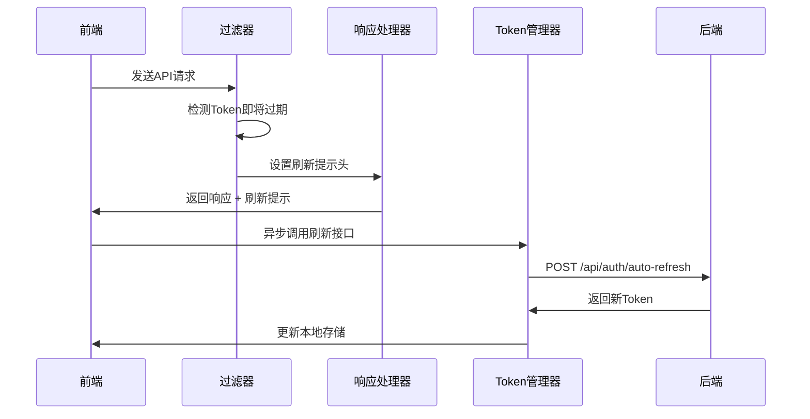
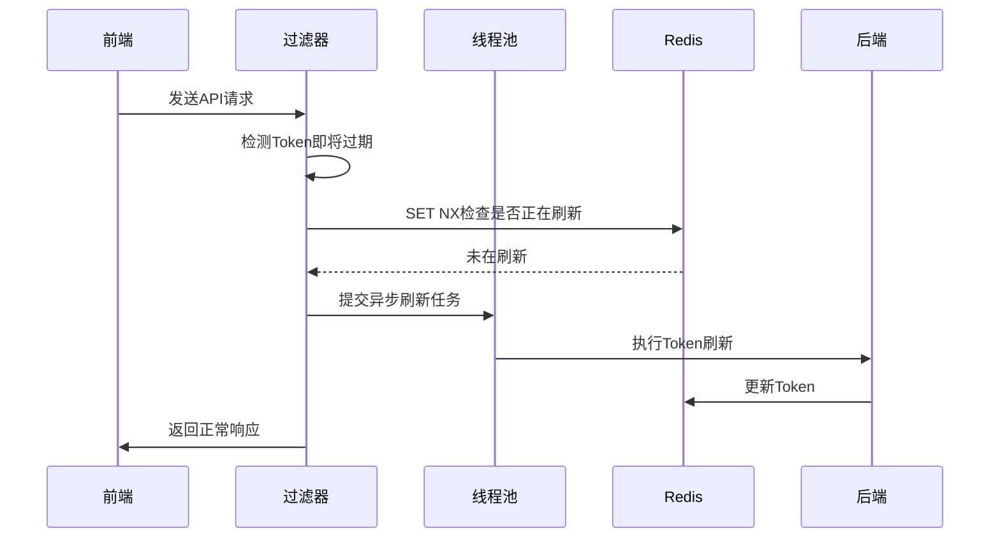
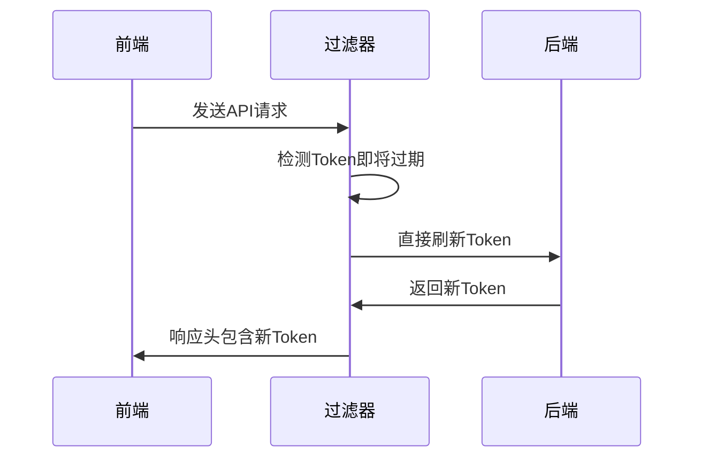
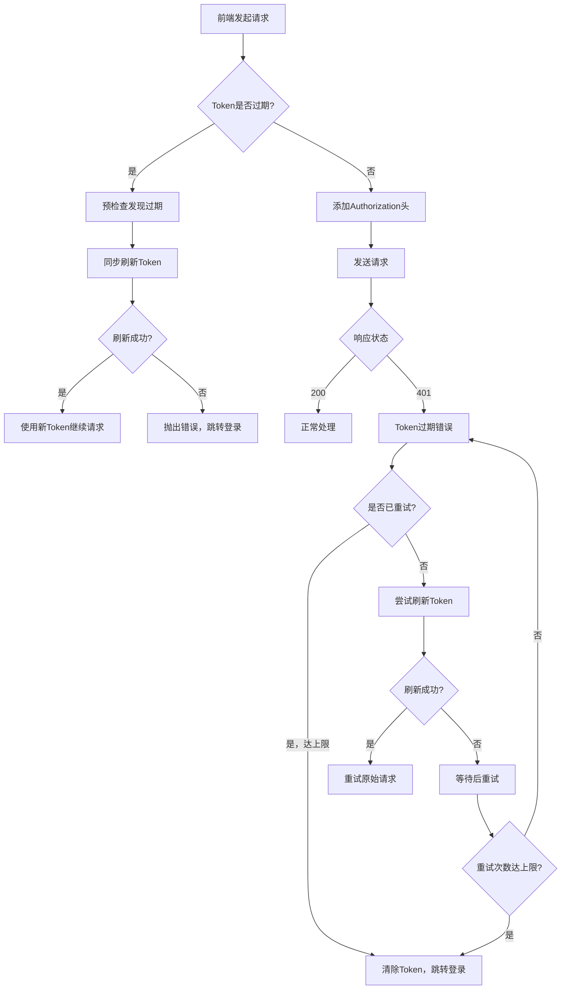

# Token刷新工作流程详解

## 🎯 大厂级Token刷新方案

当Token即将过期时，系统提供了三种处理方案，按优先级排序：

### 方案一：响应头提示 + 前端异步刷新 ⭐⭐⭐⭐⭐

这是**推荐方案**，大厂普遍采用的方式。

#### 工作流程



#### 具体实现

**1. 后端检测（JwtAuthenticationFilter）**
```java
if (jwtProperties.getEnableSlidingRefresh() && jwtTokenProvider.shouldRefreshToken(token)) {
    handleTokenRefresh(token, request, username);
}
```

**2. 添加响应头提示**
```java
private void addRefreshHeaderToResponse(HttpServletRequest request) {
    request.setAttribute(TOKEN_REFRESH_HEADER, TOKEN_REFRESH_NEEDED);
}
```

**3. 响应过滤器处理（TokenRefreshResponseFilter）**
```java
Object refreshFlag = request.getAttribute(TOKEN_REFRESH_HEADER);
if (TOKEN_REFRESH_NEEDED.equals(refreshFlag)) {
    response.setHeader(TOKEN_REFRESH_HEADER, TOKEN_REFRESH_NEEDED);
    response.setHeader("X-Token-Refresh-Message", "Token即将过期，建议刷新");
}
```

**4. 前端响应拦截器**
```javascript
response: async (response) => {
    const refreshHeader = response.headers['x-token-refresh'];
    if (refreshHeader === 'refresh-needed') {
        console.log('服务端提示Token需要刷新');

        // 异步刷新，不阻塞当前响应
        setTimeout(async () => {
            await this.autoRefreshToken();
        }, 100);
    }
    return response;
}
```

#### 优点
- ✅ **性能最佳**: 不阻塞当前请求
- ✅ **用户无感知**: 异步处理
- ✅ **可靠性高**: 失败不影响当前请求
- ✅ **大厂标配**: Google、Facebook等都用此方案

### 方案二：异步刷新 ⚡⚡⚡⚡

后台自动刷新，适合对用户体验要求极高的场景。

#### 工作流程



#### 实现要点

**分布式锁防止并发**
```java
Boolean acquired = redisTemplate.opsForValue().setIfAbsent(asyncRefreshKey, refreshValue, 60, TimeUnit.SECONDS);
if (!Boolean.TRUE.equals(acquired)) {
    log.debug("用户{}的Token正在异步刷新中，跳过", username);
    return;
}
```

**线程池配置**
```java
@Bean(name = "asyncTaskExecutor")
public ThreadPoolTaskExecutor asyncTaskExecutor() {
    ThreadPoolTaskExecutor executor = new ThreadPoolTaskExecutor();
    executor.setCorePoolSize(4);
    executor.setMaxPoolSize(8);
    executor.setQueueCapacity(100);
    executor.setThreadNamePrefix("async-token-");
    return executor;
}
```

#### 适用场景
- 高并发系统
- 对性能要求极高
- 可以接受一定复杂性

### 方案三：预刷新 🔄⚡⚡

简单直接，适合小型系统。

#### 工作流程



#### 实现代码

```java
private void preRefreshToken(String token, HttpServletRequest request, HttpServletResponse response) {
    // 生成新Token并设置到响应头
    String newAccessToken = jwtTokenProvider.createRefreshedToken(token, userDetails, request, fingerprint);
    response.setHeader("X-New-Access-Token", newAccessToken);
    response.setHeader("X-Token-Refreshed", "true");
}
```

## 📊 方案对比

| 方案 | 性能 | 复杂性 | 用户体验 | 适用场景 |
|------|------|--------|----------|----------|
| 响应头提示 | ⭐⭐⭐⭐⭐ | ⭐⭐⭐ | ⭐⭐⭐⭐⭐ | 大厂推荐 |
| 异步刷新 | ⭐⭐⭐⭐ | ⭐⭐⭐⭐⭐ | ⭐⭐⭐⭐⭐ | 高并发系统 |
| 预刷新 | ⭐⭐⭐ | ⭐⭐ | ⭐⭐⭐⭐ | 小型系统 |

## 🔧 配置建议

### 生产环境配置

```yaml
jwt:
  access-token-expiration: 900      # 15分钟
  refresh-token-expiration: 2592000 # 30天
  auto-refresh-threshold: 300       # 5分钟前刷新
  enable-sliding-refresh: true      # 启用滑动刷新
  max-refresh-count: 10             # 最大续签次数
```

### 前端配置

```javascript
const tokenManager = new TokenManager({
    baseURL: '/api',
    refreshThreshold: 300,    // 5分钟
    autoRefresh: true,        // 启用自动监听
    maxRetries: 3            // 重试次数
});
```

## 🚀 最佳实践

### 1. 选择合适的刷新方案
- **互联网应用**: 响应头提示方案
- **企业应用**: 异步刷新方案
- **小型应用**: 预刷新方案

### 2. 错误处理
```javascript
// 前端要有完善的错误处理
try {
    await this.autoRefreshToken();
} catch (error) {
    console.warn('Token刷新失败:', error);
    // 可以选择跳转登录或继续使用旧Token
}
```

### 3. 监控告警
```java
// 后端要监控刷新失败率
if (refreshFailed) {
    log.warn("Token刷新失败: {}", username);
    // 发送告警通知
}
```

### 4. 性能监控
- 监控Token刷新频率
- 监控异步任务队列长度
- 监控Redis连接池状态

## 🚨 Token过期处理完整流程

### 前端Token过期检测和处理

#### 1. 请求前预检查（Request Interceptor）

```javascript
request: async (config) => {
    const token = this.getAccessToken();

    if (token && !isAuthRequest) {
        // 预检查：Token是否已经过期
        if (this.isTokenExpired()) {
            console.warn('检测到Access Token已过期，尝试刷新');

            try {
                // 同步刷新Token，避免发送过期Token
                await this.refreshToken();
                const newToken = this.getAccessToken();
                if (newToken) {
                    config.headers.Authorization = `Bearer ${newToken}`;
                } else {
                    throw new Error('刷新后仍无有效Token');
                }
            } catch (refreshError) {
                // 刷新失败，直接抛出错误
                throw new Error('TOKEN_EXPIRED_AND_REFRESH_FAILED');
            }
        } else {
            // Token正常，添加Authorization头
            config.headers.Authorization = `Bearer ${token}`;

            // 如果即将过期，异步刷新
            if (this.shouldRefresh()) {
                setTimeout(async () => {
                    await this.autoRefreshToken();
                }, 0);
            }
        }
    }

    return config;
}
```

#### 2. 响应错误处理（Response Error Interceptor）

```javascript
responseError: async (error) => {
    const { response, config } = error;

    // 401错误 - Token过期
    if (response?.status === 401) {
        // 防止无限重试
        if (config._retryCount >= this.maxRetries) {
            this.clearTokens();
            this.redirectToLogin('Token刷新失败，请重新登录');
            return Promise.reject(new Error('TOKEN_REFRESH_EXHAUSTED'));
        }

        config._retryCount = (config._retryCount || 0) + 1;

        try {
            // 尝试刷新Token
            await this.refreshToken();
            const newToken = this.getAccessToken();

            if (newToken) {
                // 重试原始请求
                config.headers.Authorization = `Bearer ${newToken}`;
                return axios(config);
            }
        } catch (refreshError) {
            // 刷新失败，继续重试或跳转登录
            if (config._retryCount >= this.maxRetries) {
                this.redirectToLogin('登录已过期，请重新登录');
            } else {
                // 指数退避重试
                const delay = 1000 * Math.pow(2, config._retryCount - 1);
                await new Promise(resolve => setTimeout(resolve, delay));
                return this.createInterceptor().responseError(error);
            }
        }
    }

    return Promise.reject(error);
}
```

#### 3. 完整的Token过期处理流程



### 错误处理策略

#### 1. 多层次错误处理
```javascript
// 1. 请求前预检查 - 防止发送过期Token
// 2. 响应错误拦截 - 处理401错误
// 3. 全局错误处理 - 处理其他异常情况
```

#### 2. 智能重试机制
```javascript
// 指数退避算法
const delay = 1000 * Math.pow(2, retryCount - 1);

// 防止无限循环
if (retryCount >= maxRetries) {
    redirectToLogin();
}
```

#### 3. 用户体验优化
```javascript
// 显示友好的提示消息
if (typeof window.showToast === 'function') {
    window.showToast('登录已过期，请重新登录', 'warning');
}

// 避免重复跳转
if (window.location.pathname !== '/login') {
    window.location.href = '/login';
}
```

## 🎯 总结

**推荐的Token过期处理策略：**

1. **请求前预检查** - 防止发送过期Token，提升成功率
2. **响应错误智能重试** - 自动刷新并重试，指数退避算法
3. **多层次错误处理** - 区分不同错误类型，提供针对性处理
4. **用户体验优化** - 友好的提示消息，平滑的登录跳转

这种处理方式确保了：
- ✅ **高成功率**: 预检查 + 自动重试
- ✅ **好体验**: 无感知刷新，用户无中断
- ✅ **高可靠性**: 多重保护，防止死循环
- ✅ **易维护**: 集中处理，逻辑清晰

前端Token过期处理是大厂认证系统的核心，好的实现能显著提升用户体验！🚀
